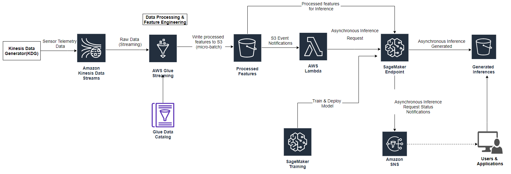

## Building a Predictive Maintenance solution with AWS Kinesis, AWS Glue & Amazon SageMaker

Organizations are increasingly building and leveraging Machine Learning (ML) powered solutions for a variety of use cases and problems ranging from predictive maintenance of machine parts, product recommendations based on customer preferences, credit profiling, content moderation, fraud detection etc. among many others. In many of these scenarios, the effectiveness and benefits derived from these ML powered solutions can be further enhanced, when they can process and derive insights from data events in near real-time. 

While the business value and benefits of near real-time ML powered solutions are well established, the architecture required to implement these solutions at scale, with optimum reliability and performance are complicated. This blog post describes how you can combine Amazon Kinesis, AWS Glue & Amazon SageMaker to build a near real-time feature engineering and inference solution for predictive maintenance.

### Use Case Overview

We focus on a predictive maintenance use case where sensors deployed in the field (industrial equipment, network devices etc.), need to replaced or rectified before they become faulty and cause downtime. Downtime can be expensive for businesses and can lead to poor customer experience. Predictive maintenance powered by a ML model can also help in augmenting the regular schedule-based maintenance cycles, by informing when a machine part in good condition should not be replaced and therefore avoid unnecessary cost.

In this post we will specifically focus on applying machine learning to a synthetic dataset containing machine failures due to features such as air temperature, process temperature, rotation speed, torque and tool wear. The dataset used is sourced from UCI Data Repository and more information can be found here: 

https://archive.ics.uci.edu/ml/datasets/AI4I+2020+Predictive+Maintenance+Dataset

-	Tool Wear Failure (TWF)
-	Heat Dissipation Failure (HDF)
-	Power Failure (PWF)
-	Over-strain Failure (OSF)
-	Random Failure (RNF) 

The machine failure consists of five independent failure modes:

The 'machine failure' label indicates, whether the machine has failed for a particular data point, if any of the following failure modes are true. If at least one of the above failure modes is true, the process fails and the 'machine failure' label is set to 1. The objective for the ML model is to identify machine failures correctly, so a downstream predictive maintenance action can be initiated.

### Architecture Overview

For our predictive maintenance use case, we assume that device sensors stream various measurements and readings about machine parts. Our solution then takes a slice of streaming data each time(micro-batch), performs processing and feature engineering to create features. The created features are then used to generate inferences from a trained and deployed ML model in near-real time. The generated inferences then can be further processed and consumed by downstream applications, to take appropriate actions and initiate maintenance activity.

The following diagram shows the architecture of our overall solution.

 

The solution broadly consists of the following sections, which are explained in detail subsequently:

-	Streaming Data Source & Ingestion - We use Amazon Kinesis Data Streams to collect streaming data from the field sensors at scale and make available for further processing
-	Near Real-time Feature Engineering - We use AWS Glue Streaming jobs to read data from a Kinesis Data Stream and perform data processing and feature engineering, before storing the derived features in a S3 location. Amazon S3 provides reliable and cost-effective option to store large volumes of data. 
-	Model Training & Deployment - We use the AI4I predictive maintenance dataset from UCI Data Repository to train a ML model based on XGBoost algorithm using Amazon SageMaker. We then deploy the trained model to an asynchronous SageMaker endpoint.
-	Near Real-time ML Inference - Once the features are available in S3, we need to generate inferences from the deployed model in near real time. Asynchronous SageMaker endpoints are well suited for this requirement as they support larger payload sizes (up to 1 GB) and can generate inferences within minutes (up to a maximum of 15 minutes). We use S3 event notifications to run a Lambda function to invoke a SageMaker endpoint, asynchronously. SageMaker asynchronous endpoints accept S3 locations as input, generate inference from the deployed model and write these inferences back to S3 in near real time.

## Security

See [CONTRIBUTING](CONTRIBUTING.md#security-issue-notifications) for more information.

## License

This library is licensed under the MIT-0 License. See the LICENSE file.

